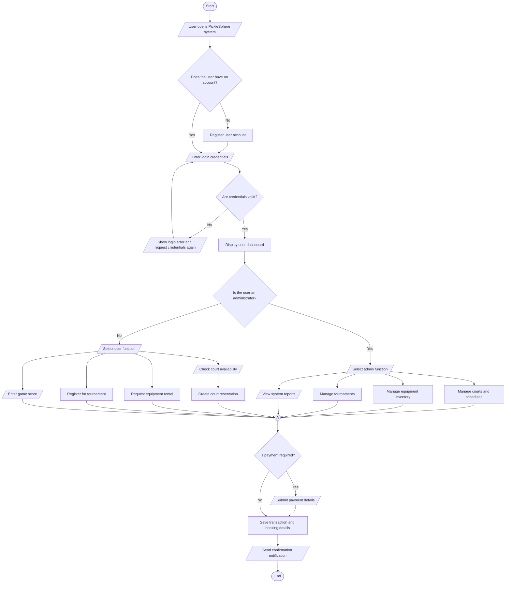

# PickleSphere System Flowchart

This flowchart shows the main process of the PickleSphere system using standard flowchart symbols.

## Legend

- **Start/End**: Terminal shape, not a circle
- **Input/Output**: Parallelogram
- **Process**: Rectangle
- **Decision**: Diamond
- **On-page connector**: Small circle used to continue the flow on the same page

## System Flowchart

