# PickleSphere - System Overview

## Table of Contents
- [System Overview](#system-overview)
- [Purpose of the System](#purpose-of-the-system)
- [Target Users](#target-users)
- [System Flowchart](#system-flowchart)
- [System Architecture](#system-architecture)
- [Key Features](#key-features)

---

## System Overview

PickleSphere is a comprehensive **Pickleball Facility & Game Management System** built with Django framework. The system provides an integrated platform for managing pickleball court reservations, equipment rentals, game scoring, tournament organization, and user management. It serves as a centralized solution for pickleball facility operators and players to streamline operations and enhance the overall playing experience.

### Technology Stack
- **Backend Framework**: Django 4.2+
- **Database**: MySQL
- **Real-time Communication**: Django Channels with Redis
- **Frontend**: Django Templates with Crispy Forms
- **Authentication**: Custom User Model with Django Auth
- **Media Management**: Pillow for image handling

### System Modules
The system consists of the following integrated modules:
- **Accounts**: User registration, authentication, and profile management
- **Courts**: Court information, images, and availability management
- **Reservations**: Court booking system with scheduling
- **Payments**: Payment processing and transaction logging
- **Scoring**: Game scoring system with customizable formats
- **Notifications**: Real-time notification system
- **Dashboard**: Centralized admin and user dashboard
- **Equipment**: Equipment rental management
- **Tournaments**: Tournament organization and management

---

## Purpose of the System

The primary purpose of PickleSphere is to digitize and streamline the operations of pickleball facilities while providing an enhanced experience for players. The system addresses the following key objectives:

### Operational Efficiency
- Automate court reservation processes
- Reduce manual administrative tasks
- Streamline equipment rental management
- Centralize facility operations

### User Experience Enhancement
- Provide easy online booking capabilities
- Enable real-time availability checking
- Offer comprehensive game tracking and scoring
- Facilitate tournament participation

### Data Management
- Maintain comprehensive user profiles
- Track reservation history and patterns
- Monitor equipment inventory and usage
- Generate reports for facility analytics

### Communication
- Send automated notifications for bookings
- Provide updates on tournament schedules
- Enable real-time communication between users and administrators

---

## Target Users

### Primary Users

#### 1. Facility Administrators/Staff
- **Role**: Manage day-to-day facility operations
- **Key Needs**: 
  - Court management and scheduling
  - User account oversight
  - Payment processing
  - Equipment inventory tracking
  - Tournament organization
  - System configuration and settings

#### 2. Players (Regular Users)
- **Role**: End users who utilize the facility
- **Key Needs**:
  - Court reservation and booking
  - Profile and skill level management
  - Game scoring and tracking
  - Equipment rental
  - Tournament registration
  - Payment processing

#### 3. Tournament Organizers
- **Role**: Coordinate and manage pickleball tournaments
- **Key Needs**:
  - Tournament creation and scheduling
  - Participant registration
  - Bracket management
  - Score tracking
  - Results publication

### Secondary Users

#### 4. Equipment Managers
- **Role**: Oversee equipment inventory and maintenance
- **Key Needs**:
  - Equipment catalog management
  - Rental tracking
  - Maintenance scheduling
  - Availability monitoring

#### 5. Finance/Accounting Staff
- **Role**: Handle financial transactions
- **Key Needs**:
  - Payment verification
  - Transaction logging
  - Revenue reporting
  - Refund processing

---

## System Flowchart

```mermaid
flowchart TD
    Start([Start]) --> UserLogin{User Login}
    
    UserLogin --> AdminUser[Administrator]
    UserLogin --> PlayerUser[Player]
    UserLogin --> OrganizerUser[Tournament Organizer]
    
    %% Administrator Path
    AdminUser --> AdminLogin[Login to Admin Panel]
    AdminLogin --> AdminDash[Admin Dashboard]
    AdminDash --> AdminTask{Select Task}
    
    AdminTask --> CourtMgmt[Manage Courts]
    AdminTask --> UserMgmt[Manage Users]
    AdminTask --> EquipMgmt[Manage Equipment]
    AdminTask --> ReportView[View Reports]
    AdminTask --> TourneyMgmt[Manage Tournaments]
    
    CourtMgmt --> CourtAction{Action}
    CourtAction --> AddCourt[Add Court]
    CourtAction --> EditCourt[Edit Court]
    CourtAction --> DelCourt[Delete Court]
    AddCourt --> SaveCourtDB[Save to Database]
    EditCourt --> SaveCourtDB
    DelCourt --> SaveCourtDB
    SaveCourtDB --> AdminDash
    
    UserMgmt --> UserAction{Action}
    UserAction --> ViewUser[View Users]
    UserAction --> EditUserProfile[Edit User]
    UserAction --> SuspendUserAcc[Suspend User]
    ViewUser --> AdminDash
    EditUserProfile --> SaveUserDB[Save Changes]
    SuspendUserAcc --> SaveUserDB
    SaveUserDB --> AdminDash
    
    EquipMgmt --> EquipAction{Action}
    EquipAction --> AddEquip[Add Equipment]
    EquipAction --> EditEquip[Edit Equipment]
    EquipAction --> ViewRentals[View Rentals]
    AddEquip --> SaveEquipDB[Save to Database]
    EditEquip --> SaveEquipDB
    ViewRentals --> AdminDash
    SaveEquipDB --> AdminDash
    
    ReportView --> GenReport[Generate Report]
    GenReport --> AdminDash
    
    TourneyMgmt --> TourneyAction{Action}
    TourneyAction --> CreateTourney[Create Tournament]
    TourneyAction --> EditTourney[Edit Tournament]
    TourneyAction --> ViewTourneyResults[View Results]
    CreateTourney --> SaveTourneyDB[Save to Database]
    EditTourney --> SaveTourneyDB
    ViewTourneyResults --> AdminDash
    SaveTourneyDB --> AdminDash
    
    %% Player Path
    PlayerUser --> PlayerLogin[Login to Account]
    PlayerLogin --> PlayerDash[Player Dashboard]
    PlayerDash --> PlayerTask{Select Task}
    
    PlayerTask --> BookCourtTask[Book Court]
    PlayerTask --> RentEquipTask[Rent Equipment]
    PlayerTask --> JoinTourneyTask[Join Tournament]
    PlayerTask --> ViewProfileTask[View Profile]
    PlayerTask --> ViewHistoryTask[View History]
    
    BookCourtTask --> CheckAvail[Check Availability]
    CheckAvail --> IsAvail{Available?}
    IsAvail --> NoAvail[Select Different Date]
    IsAvail --> YesAvail[Select Time Slot]
    NoAvail --> CheckAvail
    YesAvail --> ProcessPay[Process Payment]
    ProcessPay --> PaySuccess{Payment OK?}
    PaySuccess --> PayRetry[Retry Payment]
    PaySuccess --> PayConfirm[Confirm Booking]
    PayRetry --> ProcessPay
    PayConfirm --> SaveBookingDB[Save Booking]
    SaveBookingDB --> SendBookNotify[Send Notification]
    SendBookNotify --> PlayerDash
    
    RentEquipTask --> ViewEquipList[View Equipment]
    ViewEquipList --> SelectEquip[Select Equipment]
    SelectEquip --> ProcessEquipPay[Process Payment]
    ProcessEquipPay --> EquipPaySuccess{Payment OK?}
    EquipPaySuccess --> EquipPayRetry[Retry Payment]
    EquipPaySuccess --> EquipPayConfirm[Confirm Rental]
    EquipPayRetry --> ProcessEquipPay
    EquipPayConfirm --> SaveRentalDB[Save Rental]
    SaveRentalDB --> SendEquipNotify[Send Notification]
    SendEquipNotify --> PlayerDash
    
    JoinTourneyTask --> ViewTourneyList[View Tournaments]
    ViewTourneyList --> SelectTourney[Select Tournament]
    SelectTourney --> RegisterTourney[Register]
    RegisterTourney --> ProcessTourneyPay[Process Payment]
    ProcessTourneyPay --> TourneyPaySuccess{Payment OK?}
    TourneyPaySuccess --> TourneyPayRetry[Retry Payment]
    TourneyPaySuccess --> TourneyPayConfirm[Confirm Registration]
    TourneyPayRetry --> ProcessTourneyPay
    TourneyPayConfirm --> SaveRegDB[Save Registration]
    SaveRegDB --> SendTourneyNotify[Send Notification]
    SendTourneyNotify --> PlayerDash
    
    ViewProfileTask --> ProfileAction{Action}
    ProfileAction --> UpdateProfile[Update Profile]
    ProfileAction --> ChangePass[Change Password]
    UpdateProfile --> SaveProfileDB[Save Changes]
    ChangePass --> SavePassDB[Save Password]
    SaveProfileDB --> PlayerDash
    SavePassDB --> PlayerDash
    
    ViewHistoryTask --> ShowHistory[Display History]
    ShowHistory --> PlayerDash
    
    %% Organizer Path
    OrganizerUser --> OrganizerLogin[Login as Organizer]
    OrganizerLogin --> OrganizerDash[Organizer Dashboard]
    OrganizerDash --> OrganizerTask{Select Task}
    
    OrganizerTask --> CreateEvent[Create Event]
    OrganizerTask --> MgmtParticipants[Manage Participants]
    OrganizerTask --> TrackScores[Track Scores]
    OrganizerTask --> PublishResults[Publish Results]
    
    CreateEvent --> EnterEventDetails[Enter Details]
    EnterEventDetails --> SaveEventDB[Save Event]
    SaveEventDB --> OrganizerDash
    
    MgmtParticipants --> ViewParticipants[View Participants]
    ViewParticipants --> ParticipantAction{Action}
    ParticipantAction --> ApprovePart[Approve]
    ParticipantAction --> RejectPart[Reject]
    ApprovePart --> UpdatePartStatus[Update Status]
    RejectPart --> UpdatePartStatus
    UpdatePartStatus --> OrganizerDash
    
    TrackScores --> SelectMatch[Select Match]
    SelectMatch --> EnterMatchScores[Enter Scores]
    EnterMatchScores --> SaveScoresDB[Save Scores]
    SaveScoresDB --> OrganizerDash
    
    PublishResults --> GenResults[Generate Results]
    GenResults --> PublishToPublic[Publish]
    PublishToPublic --> OrganizerDash
    
    %% Logout Flow
    AdminDash --> LogoutCheck{Logout?}
    PlayerDash --> LogoutCheck
    OrganizerDash --> LogoutCheck
    
    LogoutCheck --> YesLogout[Logout User]
    LogoutCheck --> NoLogout[Return to Dashboard]
    YesLogout --> End([End])
    NoLogout --> AdminDash
    NoLogout --> PlayerDash
    NoLogout --> OrganizerDash
    
    %% Styling
    classDef startEnd fill:#2ecc71,stroke:#27ae60,stroke-width:3px,color:#fff
    classDef process fill:#3498db,stroke:#2980b9,stroke-width:2px,color:#fff
    classDef decision fill:#f39c12,stroke:#e67e22,stroke-width:2px,color:#fff
    classDef database fill:#9b59b6,stroke:#8e44ad,stroke-width:2px,color:#fff
    classDef user fill:#e74c3c,stroke:#c0392b,stroke-width:2px,color:#fff
    
    class Start,End startEnd
    class AdminLogin,AdminDash,PlayerLogin,PlayerDash,OrganizerLogin,OrganizerDash,YesLogout process
    class UserLogin,AdminTask,CourtAction,UserAction,EquipAction,IsAvail,PaySuccess,EquipPaySuccess,TourneyPaySuccess,ProfileAction,ParticipantAction,LogoutCheck decision
    class SaveCourtDB,SaveUserDB,SaveEquipDB,SaveTourneyDB,SaveBookingDB,SaveRentalDB,SaveRegDB,SaveProfileDB,SavePassDB,SaveEventDB,UpdatePartStatus,SaveScoresDB database
    class AdminUser,PlayerUser,OrganizerUser user
```



### Flowchart Legend

| Symbol | Description |
|--------|-------------|
| **Oval** | Start/End points |
| **Rectangle** | Process/Action |
| **Diamond** | Decision point |
| **Cylinder** | Database operation |
| **Parallelogram** | Input/Output (implied in process) |
| **Rounded Rectangle** | User roles |

---

## System Architecture

### Three-Tier Architecture

```
┌─────────────────────────────────────────────────────────┐
│                    Presentation Layer                    │
│  ┌──────────────┐  ┌──────────────┐  ┌──────────────┐  │
│  │   Web UI     │  │  Admin Panel │  │  Mobile View │  │
│  │  (Templates) │  │   (Django    │  │  (Responsive)│  │
│  │              │  │    Admin)    │  │              │  │
│  └──────────────┘  └──────────────┘  └──────────────┘  │
└─────────────────────────────────────────────────────────┘
                            ↓
┌─────────────────────────────────────────────────────────┐
│                     Application Layer                    │
│  ┌──────────┐  ┌──────────┐  ┌──────────┐  ┌─────────┐ │
│  │ Accounts │  │ Reserva- │  │ Payments │  │ Scoring │ │
│  │   App    │  │  tions   │  │   App    │  │   App   │ │
│  └──────────┘  └──────────┘  └──────────┘  └─────────┘ │
│  ┌──────────┐  ┌──────────┐  ┌──────────┐  ┌─────────┐ │
│  │  Courts  │  │Equipment │  │Tournament│  │Notifica-│ │
│  │   App    │  │   App    │  │   App    │  │  tions  │ │
│  └──────────┘  └──────────┘  └──────────┘  └─────────┘ │
└─────────────────────────────────────────────────────────┘
                            ↓
┌─────────────────────────────────────────────────────────┐
│                      Data Layer                          │
│  ┌──────────────────────────────────────────────────┐   │
│  │              MySQL Database                      │   │
│  │  ┌─────────┐ ┌─────────┐ ┌─────────┐ ┌────────┐ │   │
│  │  │ Users   │ │ Courts  │ │ Booking │ │Payment │ │   │
│  │  └─────────┘ └─────────┘ └─────────┘ └────────┘ │   │
│  │  ┌─────────┐ ┌─────────┐ ┌─────────┐ ┌────────┐ │   │
│  │  │Equipment│ │Tourney  │ │Scores   │ │Notif.  │ │   │
│  │  └─────────┘ └─────────┘ └─────────┘ └────────┘ │   │
│  └──────────────────────────────────────────────────┘   │
│  ┌──────────────────────────────────────────────────┐   │
│  │              Redis (Caching/Sessions)            │   │
│  └──────────────────────────────────────────────────┘   │
└─────────────────────────────────────────────────────────┘
```

---

## Key Features

### 1. User Management
- Custom user model with extended profiles
- Role-based access control (Admin, Player, Organizer)
- Profile customization with skill levels
- Authentication and authorization

### 2. Court Reservation System
- Real-time court availability checking
- Flexible booking schedules
- Automated confirmation notifications
- Booking history and management

### 3. Equipment Rental
- Equipment catalog with images
- Availability tracking
- Rental period management
- Payment integration

### 4. Payment Processing
- Secure payment handling
- Transaction logging
- Refund processing
- Payment history

### 5. Game Scoring
- Customizable scoring formats
- Real-time score updates
- Match history tracking
- Statistics generation

### 6. Tournament Management
- Tournament creation and scheduling
- Participant registration
- Bracket management
- Results tracking and publication

### 7. Notification System
- Real-time notifications via Django Channels
- Email notifications
- In-app notification center
- Notification preferences

### 8. Dashboard
- Centralized admin dashboard
- User-specific dashboards
- Analytics and reporting
- Activity logging

---

## Database Schema Overview

### Core Tables
- **users**: User accounts and profiles
- **courts**: Court information and images
- **reservations**: Booking records
- **payments**: Payment transactions
- **equipment**: Equipment inventory
- **rentals**: Equipment rental records
- **tournaments**: Tournament events
- **participants**: Tournament participants
- **matches**: Match records and scores
- **notifications**: Notification records

---

## Security Features

- CSRF protection
- SQL injection prevention (Django ORM)
- XSS protection
- Secure password hashing
- Session management
- Authentication middleware
- File upload validation

---

## Future Enhancements

- Mobile application (iOS/Android)
- Advanced analytics and reporting
- AI-powered court recommendations
- Social features (friend system, chat)
- Integration with payment gateways (Stripe, PayPal)
- Multi-facility support
- API for third-party integrations

---

*Document Version: 1.0*  
*Last Updated: May 2026*  
*System: PickleSphere v1.0*
