# Admin Flowchart - PickleSphere

**Legend:**
- `(( ))` - Start/End (Terminal)
- `[/ /]` - Input/Output (Data)
- `{ }` - Process/Action (Rectangle)
- `{{ }}` - Decision (Diamond)
- `[/\\ /\\]` - Database/Storage
- `> ]` - Predefined Process (Subroutine)
- `{{ }}` - Manual Operation (Trapezoid)

```mermaid
flowchart TD
    %% Styling
    classDef terminal fill:#e1f5fe,stroke:#01579b,stroke-width:3px
    classDef process fill:#fff3e0,stroke:#ef6c00,stroke-width:2px
    classDef decision fill:#f3e5f5,stroke:#6a1b9a,stroke-width:2px
    classDef data fill:#e8f5e9,stroke:#2e7d32,stroke-width:2px
    classDef db fill:#fff8e1,stroke:#ff8f00,stroke-width:2px
    classDef subroutine fill:#fce4ec,stroke:#c2185b,stroke-width:2px
    classDef admin fill:#ffebee,stroke:#b71c1c,stroke-width:2px

    %% Start
    START((START)):::terminal

    %% Authentication
    START --> LOGIN[/Admin Login/]:::data
    LOGIN --> VERIFY_ADMIN{Verify<br/>Admin Role}:::decision
    VERIFY_ADMIN -->|Denied| ACCESS_DENIED[/Access Denied/]:::data
    VERIFY_ADMIN -->|Success| ADMIN_DASH[ADMIN Dashboard]:::admin

    %% Admin Dashboard - Full Analytics
    ADMIN_DASH --> FULL_METRICS[/Full System Metrics/]:::data

    FULL_METRICS --> USER_METRICS[
        User Metrics:
        ├─ Total Users: ###
        ├─ Active Users: ###
        └─ New Today: ##
    ]:::db

    FULL_METRICS --> RES_METRICS[
        Reservation Metrics:
        ├─ Total Reservations: ###
        ├─ Today: ##
        ├─ Pending: ##
        └─ Confirmed: ###
    ]:::db

    FULL_METRICS --> REVENUE_METRICS[
        Revenue Metrics:
        ├─ Total Revenue: ₱#####
        ├─ Today: ₱####
        ├─ This Month: ₱#####
        └─ Pending: ₱####
    ]:::db

    FULL_METRICS --> COURT_METRICS[
        Court Metrics:
        ├─ Total Courts: ##
        ├─ Active: ##
        └─ Utilization: ##%
    ]:::db

    ADMIN_DASH --> ADMIN_NAV{Admin Action}:::decision

    %% === USER MANAGEMENT (Full CRUD) ===
    ADMIN_NAV -->|Users| USER_CRUD>User Management - Full CRUD]:::subroutine

    USER_CRUD --> USER_LIST[/All Users List/]:::data
    USER_LIST --> USER_FILTER{Filter/Sort}:::decision
    USER_FILTER -->|By Role| FILTER_ROLE[Admin/Staff/User]:::process
    USER_FILTER -->|By Status| FILTER_STATUS[Active/Inactive]:::process
    USER_FILTER -->|Search| SEARCH_USER[Search by Name/Email]:::process

    USER_LIST --> USER_ACTION{User Action}:::decision
    USER_ACTION -->|Create| CREATE_USER_FORM[/Create User Form/]:::data
    CREATE_USER_FORM --> SET_ROLE{Set Role}:::decision
    SET_ROLE -->|Admin| CREATE_ADMIN[Create Admin Account]:::admin
    SET_ROLE -->|Staff| CREATE_STAFF[Create Staff Account]:::process
    SET_ROLE -->|User| CREATE_NORMAL[Create User Account]:::process

    USER_ACTION -->|Edit| EDIT_USER_FORM[/Edit User Form/]:::data
    EDIT_USER_FORM --> MODIFY_ROLE{Change Role?}:::decision
    MODIFY_ROLE -->|Yes| UPDATE_ROLE[Update Role]:::admin
    MODIFY_ROLE -->|No| UPDATE_PROFILE[Update Profile]:::process

    USER_ACTION -->|Delete/Deactivate| DELETE_USER{Delete User}:::admin
    DELETE_USER --> CONFIRM_DELETE{Confirm?}:::decision
    CONFIRM_DELETE -->|Yes| EXECUTE_DELETE[Deactivate Account]:::admin
    CONFIRM_DELETE -->|No| USER_LIST

    USER_ACTION -->|View Activity| USER_ACTIVITY_LOG[/View User Activity Log/]:::data
    USER_ACTIVITY_LOG --> ACTIVITY_DETAIL[
        Detailed Logs:
        - Login/Logout times
        - Actions performed
        - IP addresses
    ]:::db

    %% === RESERVATION MANAGEMENT (Full CRUD) ===
    ADMIN_NAV -->|Reservations| RES_ADMIN>Reservation Admin - Full CRUD]:::subroutine

    RES_ADMIN --> ALL_RES[/All Reservations/]:::data
    ALL_RES --> ADVANCED_FILTER{Advanced Filter}:::decision
    ADVANCED_FILTER -->|Date Range| DATE_RANGE[From - To]:::process
    ADVANCED_FILTER -->|User| BY_USER_SEARCH[Search by User]:::process
    ADVANCED_FILTER -->|Court| BY_COURT[Filter by Court]:::process
    ADVANCED_FILTER -->|Status| BY_RES_STATUS[All Statuses]:::process

    ALL_RES --> RES_ADMIN_ACTION{Admin Action}:::decision
    RES_ADMIN_ACTION -->|Create| CREATE_RES[/Create Reservation/]:::data
    CREATE_RES --> SELECT_ANY_USER{Select User}:::decision
    SELECT_ANY_USER --> ANY_USER_SEARCH[Search All Users]:::process
    CREATE_RES --> ADMIN_OVERRIDE[Override Availability]:::admin

    RES_ADMIN_ACTION -->|Edit| EDIT_ANY_RES[/Edit Any Reservation/]:::data
    EDIT_ANY_RES --> MODIFY_ALL_FIELDS[Modify All Fields]:::admin

    RES_ADMIN_ACTION -->|Delete/Cancel| DELETE_RES[/Delete Reservation/]:::data
    DELETE_RES --> FORCE_DELETE{Force Delete?}:::admin
    FORCE_DELETE -->|Yes| EXECUTE_DELETE_RES[Delete from DB]:::admin
    FORCE_DELETE -->|No| CANCEL_RES_ONLY[Mark Cancelled]:::process

    RES_ADMIN_ACTION -->|Calendar| ADMIN_CAL[/Admin Calendar View/]:::data
    ADMIN_CAL --> ALL_RES_CAL[Show All Reservations]:::db

    %% === PAYMENT MANAGEMENT (Full Control) ===
    ADMIN_NAV -->|Payments| PAY_ADMIN>Payment Admin - Full Control]:::subroutine

    PAY_ADMIN --> ALL_PAYMENTS[/All Payments/]:::data
    ALL_PAYMENTS --> PAY_FILTERS{Advanced Filters}:::decision
    PAY_FILTERS -->|Verified By| BY_VERIFIER[Admin/Staff/System]:::process
    PAY_FILTERS -->|Amount Range| BY_AMOUNT[Min - Max]:::process
    PAY_FILTERS -->|Method| BY_PAY_METHOD[All Methods]:::process

    ALL_PAYMENTS --> ENHANCED_STATS[/Enhanced Statistics/]:::data
    ENHANCED_STATS --> WEEKLY_STATS[
        Weekly Stats:
        ├─ Week Revenue: ₱#####
        └─ Week Count: ##
    ]:::db
    ENHANCED_STATS --> MONTHLY_STATS[
        Monthly Stats:
        ├─ Month Revenue: ₱#####
        └─ Month Count: ###
    ]:::db

    ALL_PAYMENTS --> PAY_ADMIN_ACTION{Admin Action}:::decision
    PAY_ADMIN_ACTION -->|Refund| PROCESS_REFUND{Process Refund}:::admin
    PROCESS_REFUND --> REFUND_REASON[/Refund Reason/]:::data
    REFUND_REASON --> EXECUTE_REFUND[Execute Refund]:::admin

    PAY_ADMIN_ACTION -->|Reverse| REVERSE_PAY{Reverse Payment}:::admin
    PAY_ADMIN_ACTION -->|Generate Reports| REVENUE_REPORTS[/Revenue Reports/]:::data
    REVENUE_REPORTS --> EXPORT_DATA{Export Format}:::decision
    EXPORT_DATA -->|CSV| EXPORT_CSV[/Download CSV/]:::data
    EXPORT_DATA -->|PDF| EXPORT_PDF[/Download PDF/]:::data
    EXPORT_DATA -->|Excel| EXPORT_EXCEL[/Download Excel/]:::data

    %% === EQUIPMENT MANAGEMENT (Full CRUD) ===
    ADMIN_NAV -->|Equipment| EQUIP_ADMIN>Equipment Admin - Full CRUD]:::subroutine

    EQUIP_ADMIN --> EQUIP_CRUD_LIST[/Equipment Inventory/]:::data
    EQUIP_CRUD_LIST --> EQUIP_ADMIN_ACTION{CRUD Action}:::decision

    EQUIP_ADMIN_ACTION -->|Create| CREATE_EQUIP[/Create Equipment/]:::data
    CREATE_EQUIP --> SET_EQUIP_DETAILS[
        Set:
        - Name, Brand
        - Type, Price
        - Quantity
        - Image
    ]:::db

    EQUIP_ADMIN_ACTION -->|Edit| EDIT_EQUIP[/Edit Equipment/]:::data
    EDIT_EQUIP --> UPDATE_ALL_FIELDS[Update Any Field]:::admin

    EQUIP_ADMIN_ACTION -->|Delete| DELETE_EQUIP{Delete Equipment}:::admin
    DELETE_EQUIP --> SOFT_DELETE[Soft Delete/Deactivate]:::admin

    EQUIP_ADMIN_ACTION -->|View History| RENTAL_HISTORY[/Full Rental History/]:::data

    %% === TOURNAMENT MANAGEMENT ===
    ADMIN_NAV -->|Tournaments| TOUR_ADMIN>Tournament Admin - Full Control]:::subroutine

    TOUR_ADMIN --> TOUR_LIST[/Tournament List/]:::data
    TOUR_LIST --> TOUR_CRUD{CRUD Action}:::decision

    TOUR_CRUD -->|Create| CREATE_TOUR[/Create Tournament/]:::data
    CREATE_TOUR --> TOUR_CONFIG[
        Configure:
        - Name, Category
        - Format, Dates
        - Entry Fee
        - Max Players
    ]:::db
    TOUR_CONFIG --> SAVE_TOUR_DRAFT[Save as Draft]:::process
    TOUR_CONFIG --> PUBLISH_TOUR[Publish Tournament]:::admin

    TOUR_CRUD -->|Edit| EDIT_TOUR[/Edit Tournament/]:::data
    EDIT_TOUR --> MODIFY_ANY_FIELD[Modify Any Setting]:::admin

    TOUR_CRUD -->|Manage| MANAGE_TOUR>Manage Tournament]:::subroutine
    MANAGE_TOUR --> REVIEW_REGS[/Review Registrations/]:::data
    REVIEW_REGS --> BULK_APPROVE[Bulk Approve]:::admin
    MANAGE_TOUR --> GENERATE_MATCHES[Generate Match Schedule]:::admin
    GENERATE_MATCHES --> AUTO_SCHEDULE[Auto-Schedule Matches]:::process
    MANAGE_TOUR --> MANAGE_BRACKET[Manage Tournament Bracket]:::admin
    MANAGE_TOUR --> LEADERBOARD[View/Edit Leaderboard]:::admin
    MANAGE_TOUR --> UPDATE_STATUS[Change Tournament Status]:::admin

    TOUR_CRUD -->|Delete| DELETE_TOUR{Delete Tournament}:::admin

    %% === CONTENT MANAGEMENT ===
    ADMIN_NAV -->|Content| CONTENT_ADMIN>Content Management]:::subroutine

    CONTENT_ADMIN --> HOMEPAGE_MGMT[/Homepage Management/]:::data
    HOMEPAGE_MGMT --> EDIT_HERO[Edit Hero Section]:::admin
    HOMEPAGE_MGMT --> MANAGE_AMENITIES[Manage Amenities]:::admin
    HOMEPAGE_MGMT --> MANAGE_GALLERY[Manage Gallery]:::admin
    HOMEPAGE_MGMT --> EDIT_TESTIMONIALS[Manage Testimonials]:::admin

    CONTENT_ADMIN --> PRICING_MGMT[/Pricing Page Management/]:::data
    PRICING_MGMT --> EDIT_CONTENT[Edit Page Content]:::admin
    PRICING_MGMT --> MANAGE_TIERS[Manage Pricing Tiers]:::admin
    PRICING_MGMT --> EDIT_FAQ[Edit FAQ Items]:::admin

    CONTENT_ADMIN --> ABOUT_MGMT[/About Page Management/]:::data
    ABOUT_MGMT --> EDIT_ABOUT_CONTENT[Edit Content]:::admin
    ABOUT_MGMT --> MANAGE_MILESTONES[Manage Milestones]:::admin
    ABOUT_MGMT --> MANAGE_TEAM[Manage Team Members]:::admin
    ABOUT_MGMT --> MANAGE_FACILITIES[Manage Facilities]:::admin

    CONTENT_ADMIN --> CONTACT_MGMT[/Contact Page Management/]:::data
    CONTACT_MGMT --> EDIT_CONTACT_INFO[Edit Contact Info]:::admin
    CONTACT_MGMT --> MANAGE_HOURS[Manage Business Hours]:::admin
    CONTACT_MGMT --> MANAGE_SOCIAL[Manage Social Links]:::admin
    CONTACT_MGMT --> VIEW_MESSAGES[/View Contact Messages/]:::data
    VIEW_MESSAGES --> REPLY_MESSAGE[Reply to Message]:::admin

    %% === COURT & SITE MANAGEMENT ===
    ADMIN_NAV -->|Courts| COURT_ADMIN>Court & Site Management]:::subroutine
    COURT_ADMIN --> MANAGE_SITES[Manage Sites/Locations]:::admin
    COURT_ADMIN --> MANAGE_COURTS[Manage Courts]:::admin
    MANAGE_COURTS --> COURT_CRUD{CRUD Court}:::decision
    COURT_CRUD -->|Create| ADD_COURT[Add New Court]:::admin
    COURT_CRUD -->|Edit| EDIT_COURT[Edit Court Details]:::admin
    COURT_CRUD -->|Delete| REMOVE_COURT[Deactivate Court]:::admin

    %% === SYSTEM ADMINISTRATION ===
    ADMIN_NAV -->|System| SYS_ADMIN>System Administration]:::subroutine

    SYS_ADMIN --> ACTIVITY_LOG[/Full Activity Log/]:::data
    ACTIVITY_LOG --> FILTER_ACTIVITY{Filter Logs}:::decision
    FILTER_ACTIVITY -->|By User| LOG_BY_USER[User Filter]:::process
    FILTER_ACTIVITY -->|By Action| LOG_BY_ACTION[Action Filter]:::process
    FILTER_ACTIVITY -->|By Date| LOG_BY_DATE[Date Range]:::process

    SYS_ADMIN --> SYSTEM_SETTINGS[/System Settings/]:::data
    SYSTEM_SETTINGS --> CONFIGURE[Configure System]:::admin

    %% Return Paths
    CREATE_ADMIN --> ADMIN_DASH
    CREATE_STAFF --> ADMIN_DASH
    CREATE_NORMAL --> ADMIN_DASH
    UPDATE_ROLE --> ADMIN_DASH
    UPDATE_PROFILE --> ADMIN_DASH
    EXECUTE_DELETE --> ADMIN_DASH
    ACTIVITY_DETAIL --> ADMIN_DASH
    EXECUTE_DELETE_RES --> ADMIN_DASH
    CANCEL_RES_ONLY --> ADMIN_DASH
    EXECUTE_REFUND --> ADMIN_DASH
    EXPORT_CSV --> ADMIN_DASH
    EXPORT_PDF --> ADMIN_DASH
    EXPORT_EXCEL --> ADMIN_DASH
    SET_EQUIP_DETAILS --> ADMIN_DASH
    UPDATE_ALL_FIELDS --> ADMIN_DASH
    SOFT_DELETE --> ADMIN_DASH
    RENTAL_HISTORY --> ADMIN_DASH
    SAVE_TOUR_DRAFT --> ADMIN_DASH
    PUBLISH_TOUR --> ADMIN_DASH
    MODIFY_ANY_FIELD --> ADMIN_DASH
    BULK_APPROVE --> ADMIN_DASH
    AUTO_SCHEDULE --> ADMIN_DASH
    MANAGE_BRACKET --> ADMIN_DASH
    LEADERBOARD --> ADMIN_DASH
    UPDATE_STATUS --> ADMIN_DASH
    DELETE_TOUR --> ADMIN_DASH
    EDIT_HERO --> ADMIN_DASH
    MANAGE_AMENITIES --> ADMIN_DASH
    MANAGE_GALLERY --> ADMIN_DASH
    EDIT_TESTIMONIALS --> ADMIN_DASH
    EDIT_CONTENT --> ADMIN_DASH
    MANAGE_TIERS --> ADMIN_DASH
    EDIT_FAQ --> ADMIN_DASH
    EDIT_ABOUT_CONTENT --> ADMIN_DASH
    MANAGE_MILESTONES --> ADMIN_DASH
    MANAGE_TEAM --> ADMIN_DASH
    MANAGE_FACILITIES --> ADMIN_DASH
    EDIT_CONTACT_INFO --> ADMIN_DASH
    MANAGE_HOURS --> ADMIN_DASH
    MANAGE_SOCIAL --> ADMIN_DASH
    REPLY_MESSAGE --> ADMIN_DASH
    MANAGE_SITES --> ADMIN_DASH
    ADD_COURT --> ADMIN_DASH
    EDIT_COURT --> ADMIN_DASH
    REMOVE_COURT --> ADMIN_DASH
    LOG_BY_USER --> ADMIN_DASH
    LOG_BY_ACTION --> ADMIN_DASH
    LOG_BY_DATE --> ADMIN_DASH
    CONFIGURE --> ADMIN_DASH
    ACCESS_DENIED --> END

    %% Logout
    ADMIN_NAV -->|Logout| ADMIN_LOGOUT{Admin Logout}:::process
    ADMIN_LOGOUT --> END((END)):::terminal
```

## Admin Permissions Matrix

| Function | View | Create | Edit | Delete | Special |
|----------|------|--------|------|--------|---------|
| **Users** | All users | All roles | All fields | Deactivate | Change roles |
| **Reservations** | All | For any user | All fields | Force delete | Override availability |
| **Payments** | All | - | Status | - | Process refunds, reverse |
| **Equipment** | All + history | New items | All fields | Soft delete | - |
| **Tournaments** | All | Create new | All settings | Delete | Bulk approve, bracket mgmt |
| **Courts/Sites** | All | New courts | All details | Deactivate | - |
| **Content** | All pages | Amenities, FAQ, etc. | All content | Remove items | Publish/unpublish |
| **Reports** | All stats | - | - | - | Export data |
| **System** | Activity logs | - | Settings | - | Configure system |

## Dashboard Comparison

| Metric | User | Staff | Admin |
|--------|------|-------|-------|
| **Reservations** | Personal only | Today's + Pending | Full analytics |
| **Payments** | Personal only | Verify only | Full control + refunds |
| **Users** | Self only | View only | Full CRUD |
| **Equipment** | Browse/Rent | Checkout/Checkin | Full CRUD |
| **Tournaments** | Register/Play | Support | Full management |
| **Content** | View only | No access | Full management |
| **Reports** | None | Basic stats | Full reports + export |
