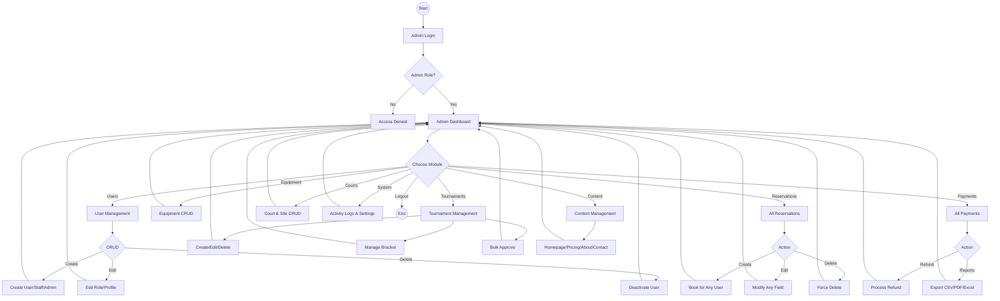

# Admin Flowchart - PickleSphere

## Admin vs Staff vs User

| Feature | User | Staff | Admin |
|---------|------|-------|-------|
| **Reservations** | Own only | View/Approve all | Full CRUD |
| **Payments** | Own only | Verify only | + Refunds/Reports |
| **Users** | Self only | View only | Full CRUD |
| **Equipment** | Rent | Checkout/Checkin | Full CRUD |
| **Tournaments** | Register/Play | Approve players | Full management |
| **Content** | View | ❌ | Full CRUD |
| **Reports** | ❌ | Basic | Full + Export |
| **System** | ❌ | ❌ | Logs & Settings |
