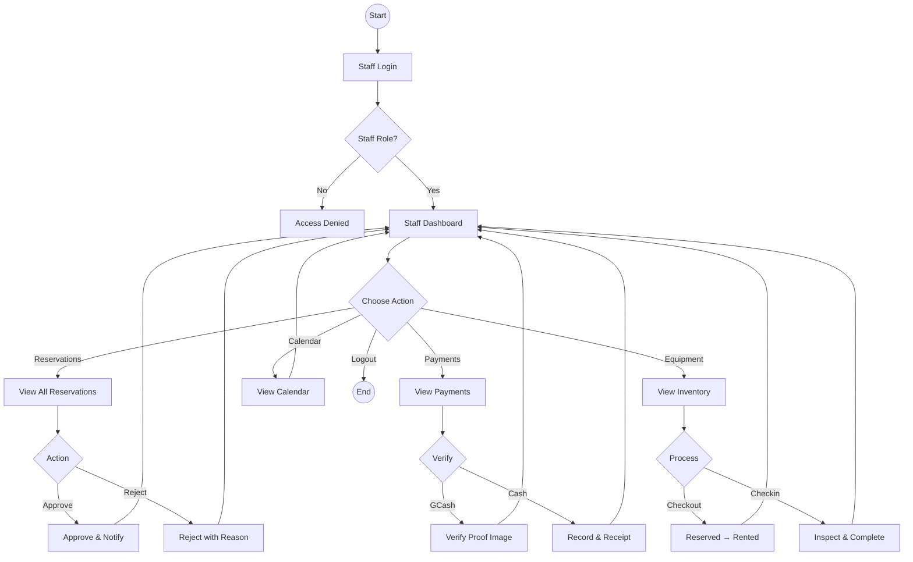

# Staff Flowchart - PickleSphere

## Staff Permissions

| Module | Permissions |
|--------|-------------|
| **Reservations** | View all, Approve/Reject |
| **Payments** | Verify GCash/Cash payments |
| **Equipment** | Checkout/Checkin only |
| **Users** | View only |
| **Tournaments** | Approve registrations |
| **Content** | No access |
