# Staff Flowchart - PickleSphere

**Legend:**
- `(( ))` - Start/End (Terminal)
- `[/ /]` - Input/Output (Data)
- `{ }` - Process/Action (Rectangle)
- `{{ }}` - Decision (Diamond)
- `[/\\ /\\]` - Database/Storage
- `> ]` - Predefined Process (Subroutine)

```mermaid
flowchart TD
    %% Styling
    classDef terminal fill:#e1f5fe,stroke:#01579b,stroke-width:2px
    classDef process fill:#fff3e0,stroke:#ef6c00,stroke-width:2px
    classDef decision fill:#f3e5f5,stroke:#6a1b9a,stroke-width:2px
    classDef data fill:#e8f5e9,stroke:#2e7d32,stroke-width:2px
    classDef db fill:#fff8e1,stroke:#ff8f00,stroke-width:2px
    classDef subroutine fill:#fce4ec,stroke:#c2185b,stroke-width:2px

    %% Start
    START((START)):::terminal

    %% Authentication
    START --> LOGIN[/Staff Login/]:::data
    LOGIN --> VERIFY_STAFF{Verify<br/>Staff Role}:::decision
    VERIFY_STAFF -->|Denied| ACCESS_DENIED[/Access Denied/]:::data
    VERIFY_STAFF -->|Success| STAFF_DASH[Staff Dashboard]:::process

    %% Staff Dashboard
    STAFF_DASH --> VIEW_METRICS[/View Key Metrics/]:::data
    VIEW_METRICS --> METRICS{Metrics Displayed}:::decision
    METRICS -->|Today's Reservations| TODAY_RES_COUNT[
        Today: ##
    ]:::db
    METRICS -->|Pending Approvals| PENDING_COUNT[
        Pending: ##
    ]:::db
    METRICS -->|Pending Payments| PENDING_PAY_COUNT[
        Payments: ##
    ]:::db
    METRICS -->|Active Matches| ACTIVE_MATCH[
        Matches: ##
    ]:::db
    METRICS -->|Equipment Stats| EQUIP_STATS[
        Stock: ##
    ]:::db

    STAFF_DASH --> NAV{Staff Action}:::decision

    %% === RESERVATIONS MANAGEMENT ===
    NAV -->|Reservations| RES_MGMT>Manage Reservations]:::subroutine

    RES_MGMT --> RES_LIST[/View All Reservations/]:::data
    RES_LIST --> FILTER_RES{Filter By}:::decision
    FILTER_RES -->|Status| BY_STATUS[Filter: Pending/Confirmed/Cancelled]:::process
    FILTER_RES -->|Date| BY_DATE[Filter: Specific Date]:::process
    FILTER_RES -->|User| BY_USER[Search by User]:::process

    RES_LIST --> SELECT_RES{Select Reservation}:::decision
    SELECT_RES --> RES_DETAIL[/Reservation Details/]:::data

    RES_DETAIL --> RES_ACTION{Staff Action}:::decision
    RES_ACTION -->|Approve| APPROVE_RES{Approve Reservation}:::process
    APPROVE_RES --> NOTIFY_USER[/Notify User/]:::data
    RES_ACTION -->|Reject| REJECT_RES{Reject Reservation}:::process
    REJECT_RES --> REJECT_REASON[/Provide Reason/]:::data
    REJECT_REASON --> NOTIFY_REJECTION[/Notify User of Rejection/]:::data
    RES_ACTION -->|View Payment| VIEW_PAY[/View Payment Status/]:::data

    %% === PAYMENTS MANAGEMENT ===
    NAV -->|Payments| PAY_MGMT>Manage Payments]:::subroutine

    PAY_MGMT --> PAY_LIST[/View All Payments/]:::data
    PAY_LIST --> FILTER_PAY{Filter By}:::decision
    FILTER_PAY -->|Status| PAY_BY_STATUS[Pending/Paid/Failed]:::process
    FILTER_PAY -->|Method| PAY_BY_METHOD[Card/GCash/Cash]:::process
    FILTER_PAY -->|Date Range| PAY_BY_DATE[Date Range Filter]:::process

    PAY_LIST --> STATS_REvenue[/View Revenue Stats/]:::data
    STATS_REvenue --> DISPLAY_STATS[
        Total Paid: ₱###
        Total Pending: ₱###
        Today's Revenue: ₱###
    ]:::db

    PAY_LIST --> SELECT_PAY{Select Payment}:::decision
    SELECT_PAY --> PAY_DETAIL[/Payment Details/]:::data
    PAY_DETAIL --> PAY_ACTION{Action}:::decision
    PAY_ACTION -->|Verify GCash| VERIFY_GCASH{Verify GCash Proof}:::process
    VERIFY_GCASH --> VIEW_PROOF[/View Uploaded Image/]:::data
    VERIFY_GCASH --> MARK_VERIFIED{Mark as Verified}:::process
    PAY_ACTION -->|Verify Cash| VERIFY_CASH{Record Cash Payment}:::process
    VERIFY_CASH --> RECEIPT_CASH[/Issue Receipt/]:::data

    %% === EQUIPMENT MANAGEMENT ===
    NAV -->|Equipment| EQUIP_MGMT>Manage Equipment]:::subroutine

    EQUIP_MGMT --> EQUIP_LIST[/View Equipment Inventory/]:::data
    EQUIP_LIST --> EQUIP_STATS_DASH[
        Total Items: ##
        Low Stock: ##
        Out of Stock: ##
        Active Rentals: ##
    ]:::db

    EQUIP_LIST --> CHECKOUT_FLOW{Checkout/Checkin}:::decision
    CHECKOUT_FLOW -->|Checkout| VIEW_RESERVED[/View Reserved Items/]:::data
    VIEW_RESERVED --> SELECT_RENTAL{Select Rental}:::decision
    SELECT_RENTAL --> CHECKOUT_PROC{Process Checkout}:::process
    CHECKOUT_PROC --> RECORD_CONDITION[/Record Condition/]:::data
    CHECKOUT_PROC --> UPDATE_STATUS[Update: Reserved → Rented]:::process

    CHECKOUT_FLOW -->|Checkin| VIEW_RENTED[/View Rented Items/]:::data
    VIEW_RENTED --> SELECT_RETURN{Select Return}:::decision
    SELECT_RETURN --> CHECKIN_PROC{Process Checkin}:::process
    CHECKIN_PROC --> INSPECT_EQUIP{Inspect Equipment}:::decision
    INSPECT_EQUIP -->|Good| COMPLETE_CHECKIN[Complete Checkin]:::process
    INSPECT_EQUIP -->|Damaged| RECORD_DAMAGE[/Record Damage/]:::data
    COMPLETE_CHECKIN --> UPDATE_INVENTORY[Update Inventory Counts]:::process

    %% === CALENDAR VIEW ===
    NAV -->|Calendar| CAL_VIEW[/View Reservation Calendar/]:::data
    CAL_VIEW --> CAL_NAV{Navigate}:::decision
    CAL_NAV -->|Prev/Next Month| MONTH_NAV[Change Month]:::process
    CAL_NAV -->|Select Date| DATE_DETAIL[/Date Reservations/]:::data
    DATE_DETAIL --> CAL_RES_ACTION{Action on Reservation}:::decision

    %% === ACTIVITY LOG ===
    NAV -->|Activity| VIEW_ACTIVITY[/View Recent Activity/]:::data
    VIEW_ACTIVITY --> ACTIVITY_LIST[
        Recent User Actions:
        - User X logged in
        - Reservation #Y created
        - Payment verified
    ]:::db

    %% === USER MANAGEMENT (View Only) ===
    NAV -->|Users| USER_VIEW[/View User List/]:::data
    USER_VIEW --> USER_SEARCH{Search User}:::decision
    USER_SEARCH --> USER_PROFILE[/View User Profile/]:::data
    USER_PROFILE --> USER_RES[/View User Reservations/]:::data
    USER_PROFILE --> USER_PAY[/View User Payments/]:::data

    %% === TOURNAMENT SUPPORT ===
    NAV -->|Tournaments| TOUR_SUPPORT>Tournament Support]:::subroutine
    TOUR_SUPPORT --> VIEW_TOUR_LIST[/View Tournaments/]:::data
    TOUR_SUPPORT --> REVIEW_REG[/Review Registrations/]:::data
    REVIEW_REG --> APPROVE_REG{Approve Registration}:::process
    APPROVE_REG --> REG_NOTIFY[/Notify Player/]:::data

    %% Return Paths
    NOTIFY_USER --> STAFF_DASH
    NOTIFY_REJECTION --> STAFF_DASH
    MARK_VERIFIED --> STAFF_DASH
    RECEIPT_CASH --> STAFF_DASH
    UPDATE_STATUS --> STAFF_DASH
    UPDATE_INVENTORY --> STAFF_DASH
    RECORD_DAMAGE --> STAFF_DASH
    CAL_RES_ACTION --> CAL_VIEW
    REG_NOTIFY --> STAFF_DASH
    ACCESS_DENIED --> END

    %% Logout
    NAV -->|Logout| STAFF_LOGOUT{Staff Logout}:::process
    STAFF_LOGOUT --> END((END)):::terminal
```



## Staff Permissions Summary

| Function | View | Approve/Verify | Modify |
|----------|------|----------------|--------|
| **Reservations** | All reservations | Approve/Reject | No create/delete |
| **Payments** | All payments | Verify GCash/Cash | No refunds |
| **Equipment** | Inventory, rentals | Checkout/Checkin | No CRUD on items |
| **Users** | View profiles | No | No |
| **Tournaments** | View, registrations | Approve players | No create/edit |
| **Content** | No access | No access | No access |

## Key Metrics Dashboard

```
┌─────────────────────────────────────────┐
│         STAFF DASHBOARD                 │
├─────────────────────────────────────────┤
│ Today's Reservations:       [Count]     │
│ Pending Approvals:          [Count]     │
│ Pending Payments:           [Count]     │
│ Active Matches:             [Count]     │
│ Equipment Low Stock:        [Count]     │
│ Active Rentals:             [Count]     │
├─────────────────────────────────────────┤
│ Recent Activity Log                     │
│ [Timestamp] [User] [Action]             │
└─────────────────────────────────────────┘
```
