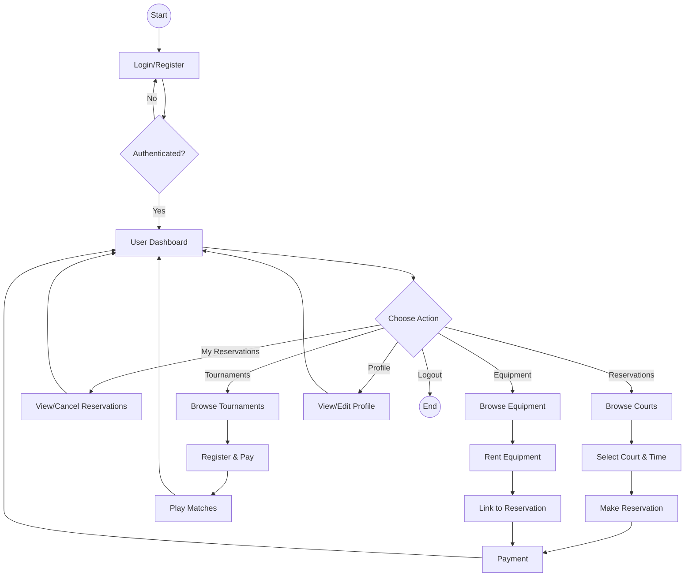

# User Flowchart - PickleSphere

## User Actions Summary

| Module | Actions |
|--------|---------|
| **Auth** | Register → Login → Dashboard |
| **Reservations** | Browse → Book → Pay → Play |
| **Tournaments** | Browse → Register → Compete |
| **Equipment** | Browse → Rent → Pay |
| **Profile** | View/Edit personal info |
