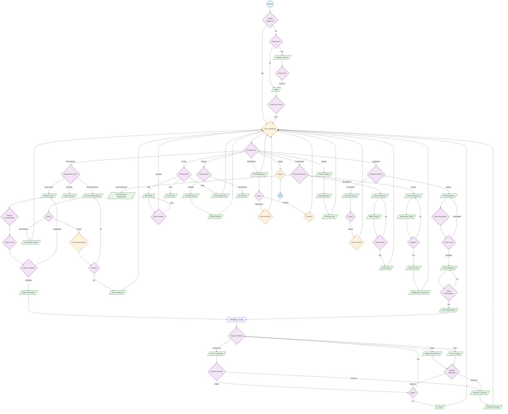

# User Flowchart - PickleSphere

**Legend:**
- `(( ))` - Start/End (Terminal)
- `[/ /]` - Input/Output (Data)
- `{ }` - Process/Action (Rectangle)
- `{{ }}` - Decision (Diamond)
- `[/\\ /\\]` - Database/Storage

## Flow Summary

| Section | Key Actions | Data Flow |
|---------|-------------|-----------|
| **Authentication** | Register → Login → Role Check | User DB ← Credentials |
| **Reservations** | Browse → Filter → Select → Book → Pay | Court DB ← Availability |
| **Payments** | Select Method → Process → Confirmation | Payment Gateway |
| **Tournaments** | Browse → Register → Pay → Compete | Tournament DB |
| **Equipment** | Browse → Check Stock → Rent → Link → Pay | Equipment DB |
| **Profile** | View/Edit → Save | User Profile DB |
| **Ratings** | Pending → Submit Review | Ratings DB |
